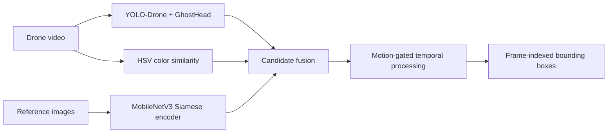

# Drone Object Localization

[](https://github.com/nguoimay1103/drone-object-localization-zalo-ai/actions/workflows/ci.yml)

Query-conditioned spatio-temporal object localization in drone videos, developed
for the Zalo AI Challenge. Given a drone video and one or more reference images,
the system returns the frames in which the target appears and one bounding box
per selected frame.

The best locked configuration reaches **0.740013 mean ST-IoU** on the project
public-test benchmark. The competition submission ranked **Top 30 / 170**.

> `Report.docx` documents an earlier `0.651489` version. The current notebooks,
> source modules, configs and audit artifacts are the source of truth.

## System overview



The production pipeline consists of:

- **Detection:** YOLO-Drone with a lightweight GhostHead candidate detector.
- **Matching:** identity-safe MobileNetV3 Siamese embeddings.
- **Fusion:** `0.425 YOLO + 0.475 Siamese + 0.100 HSV color`, threshold `0.54`.
- **Temporal processing:** linear interpolation for gaps up to 7 frames,
  normalized center-speed gate `0.4`, then removal of segments shorter than 24
  frames.
- **Safety and reproducibility:** configurable paths, checkpoint SHA-256 guards,
  zero-based absolute frame indexing and run manifests.

## Results

| Configuration | Mean ST-IoU | Status |
|---|---:|---|
| Historical report | 0.651489 | Archived |
| Original optimized baseline | 0.700454 | Archived |
| Identity-safe Siamese + calibrated fusion | 0.722052 | Superseded |
| **Motion-gated production** | **0.740013** | **Locked best** |

Detailed evidence, per-video scores and rejected experiments are recorded in
[`docs/AUDIT_AND_ROADMAP.md`](docs/AUDIT_AND_ROADMAP.md). Results from P2,
high-resolution inference, SAHI and temporal reranking were not promoted because
they did not transfer consistently across held-out identities.

## Repository layout

```text
.
├── 01_data_gen_yolo.ipynb           # Synthetic detector data
├── 02_data_merge_yolo.ipynb         # Merge real and synthetic YOLO data
├── 03_train_yolo.ipynb              # Detector training
├── 04-data-prep-matching.ipynb      # Siamese data and safe negative mining
├── 05-train-siamese.ipynb           # Identity-safe Siamese training
├── 06-inference-main.ipynb           # Production and offline A/B runner
├── 08-train-spatial-refiner-v2.ipynb # Experimental bbox refiner training
├── configs/                          # Locked YAML configurations
├── src/drone_localization/           # Reusable Python package
├── scripts/                          # CLI inference, evaluation and merging
├── tests/                            # CPU regression and contract tests
├── demo/                             # Streamlit demonstration
└── docs/                             # Protocols and audit evidence
```

## Installation

Python 3.10+ and an NVIDIA GPU are recommended. The reference environment uses
Ultralytics `8.3.221`.

```bash
git clone https://github.com/nguoimay1103/drone-object-localization-zalo-ai.git
cd drone-object-localization-zalo-ai
python -m venv .venv

# Linux/macOS
source .venv/bin/activate

# Windows PowerShell
# .venv\Scripts\Activate.ps1

python -m pip install --upgrade pip
python -m pip install -e ".[inference]"
```

Datasets are intentionally not committed. Expected sample layout:

```text
public_test/
├── annotations/drone_annotations.json   # optional for local evaluation
└── samples/
    └── <video_id>/
        ├── drone_video.mp4
        └── object_images/
            ├── reference_0.jpg
            └── ...
```

## Run the locked production pipeline

The default CLI uses
[`configs/production_0_740013.yaml`](configs/production_0_740013.yaml). Supply
paths explicitly so runs do not depend on a particular username or mount point.

First run the CPU-only preflight:

```bash
python scripts/run_inference.py --dry-run \
  --samples-dir /path/to/public_test/samples \
  --annotations /path/to/drone_annotations.json \
  --yolo-weights /path/to/yolo_drone_700.pt \
  --siamese-weights /path/to/siamese_identity_v1.pth \
  --output-dir /path/to/outputs/production
```

Then remove `--dry-run` to execute inference. Use `--no-eval` when ground truth
is unavailable. The runner refuses checkpoint hash mismatches and existing output
directories instead of silently changing the experiment.

The production checkpoints are identified in the YAML by SHA-256. They are not
bundled as Git objects; publish them as a GitHub Release or provide separate
download instructions. Checkpoints under `demo/` belong to the original demo and
must not be assumed to reproduce `0.740013`.

## Reproduce training

Run notebooks `01` through `06` in order. Each notebook contains a small Kaggle
path configuration block. Preserve these rules:

1. Frame indices are absolute and start at zero.
2. Videos ending in `_0` and `_1` for one physical object stay in the same
   Siamese split.
3. Public-test annotations are not detector or Siamese training inputs.
4. Use the production checkpoint hashes and fixed parameters when comparing
   changes.

The spatial refiner is still an offline experiment. Train it with notebook `08`;
notebook `06` blocks its public A/B unless identity-held-out CV passes.

## Tests

```bash
python -m pip install -e ".[test]"
python -m unittest discover -s tests -v
```

The tests cover configuration, ST-IoU, fusion, temporal gating, cache integrity,
identity-safe splitting and notebook contracts. They do not replace a GPU golden
run.

## Demo

```bash
python -m pip install -r demo/requirements.txt
streamlit run demo/07_demo_app.py
```

The demo uses its bundled historical weights. Notebook `06` remains the reference
for the best research configuration.
