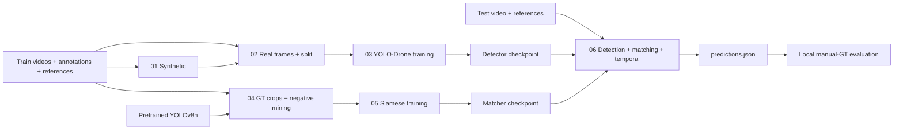

# Audit & roadmap — Drone Object Localization

Ngày: 2026-08-28. Baseline tham chiếu: **0.700454, mean ST-IoU trên bộ public-test tự gán nhãn**.

**Phần 1 đã triển khai:** notebook 05 là experiment `identity_v1`; notebook 06 có candidate cache và coarse/fine calibration. Xem [identity sampling](SIAMESE_IDENTITY_V1.md) và [calibration](SIAMESE_CALIBRATION.md). Các notebook trước thay đổi được giữ nguyên trong `baselines/`; các nhận xét lịch sử phía dưới mô tả baseline tại thời điểm audit. Fine identity-v1 đạt `0.722052`, cao hơn baseline calibrated `0.707417`; cấu hình production đã khóa tại weights `0.425/0.475/0.100`, threshold `0.540`.

**Phần 2 đã kết thúc:** safe negative mining v2, NB05 training và checkpoint-specific calibration đều hợp lệ. Fine optimum đạt `0.719278` tại weights `0.50/0.425/0.075`, threshold `0.555`; thấp hơn identity-v1 production `0.722052` khoảng `0.002773`. Không promote checkpoint mining-v2 và dừng tinh chỉnh trên cùng benchmark. Bước cải tiến tiếp theo là temporal consistency/candidate linking với checkpoint identity-v1.

**Phần 3 đã kết thúc:** joint refinement đạt offline ST-IoU `0.740013` tại gap 7/min segment 24/center gate 0.4, tăng `0.017961` so với identity-v1 legacy temporal `0.722052`. Notebook 06 đã khóa Temporal Gating V1 vào production; đường replay legacy và grid vẫn được giữ để tái lập. Kết quả này được chọn và báo cáo trên cùng sáu video gán tay nên chưa phải ước lượng generalization độc lập.

**Phần 4 đã kết thúc, không promote:** Top-K Temporal Candidate Reranking V1 không cải thiện identity-held-out CV (`delta=0`, `0/3` identity tăng). Cả 18 cấu hình bật reranking chỉ thay đổi LifeJacket_1 theo hướng giảm; năm video còn lại không đổi. Production giữ `0.740013`, runner reranking mặc định đã tắt. Bước tiếp theo là oracle error decomposition trên candidate cache để xác định detection recall, matching hay temporal coverage là bottleneck; xem [kết quả audit](audit/TEMPORAL_RERANKING_V1_RESULT.json).

**Phần 5 đã kết thúc:** Candidate-Cache Oracle Error Decomposition V1 xác nhận prediction/metric parity và chỉ ra `threshold_rejection` là lỗi lớn nhất: 822/9.505 GT frames, trong đó CardboardBox chiếm 497. Mean video oracle/selected-accepted/final lần lượt là `0.843613/0.694876/0.740013`; temporal giảm background frames từ 543 xuống 409. Runner diagnostic mặc định đã tắt. Bước tiếp theo được đề xuất là bracketed temporal threshold hysteresis để cứu weak candidate chỉ khi được hai strong anchors hỗ trợ; xem [kết quả audit](audit/CANDIDATE_ORACLE_DIAGNOSTICS_V1_RESULT.json).

**Phần 6 đã kết thúc, không promote:** Bracketed Temporal Threshold Hysteresis V1 có mean held-out delta `-0.019644`, `0/3` identity tăng và worst delta `-0.036932`. Mọi config bật đều cải thiện CardboardBox_0 nhưng làm BlackBox_1/LifeJacket suy giảm; final frames tăng 336–672. Đây là identity-specific tradeoff, không phải cải tiến tổng quát. Runner và production hysteresis mặc định đã tắt; xem [kết quả audit](audit/TEMPORAL_HYSTERESIS_V1_RESULT.json).

**Score-separability follow-up:** frame-level diagnostic cho thấy fused score có weak-region ROC-AUC `0.8951` nhưng average precision chỉ `0.3671` do positive prevalence `6.26%`. Identity-optimal F1 thresholds phân tán mạnh (`0.581/0.486/0.556` cho BlackBox/CardboardBox/LifeJacket); leave-one-identity-out threshold transfer làm F1 held-out giảm ở cả ba fold. Không triển khai adaptive threshold chỉ từ absolute fused score; xem [audit](audit/SCORE_SEPARABILITY_DIAGNOSTIC_RESULT.json).

**Phần 7 đã kết thúc, không promote:** Candidate Margin & Component Diagnostics V1 xác nhận fused `selected_score` vẫn là tín hiệu weak-region tốt nhất (`AUC 0.8951`, AP `0.3671`). Top1-top2 margin chỉ đạt `AUC 0.5728`, AP `0.1359`; score ratio `0.6231/0.1690`. Component hữu ích thay đổi theo identity: Siamese mạnh ở BlackBox/CardboardBox, Color mạnh ở LifeJacket. Leave-one-identity-out threshold transfer của các component không ổn định và có fold suy giảm nghiêm trọng. Không triển khai margin/component-gated recovery; runner mặc định đã tắt và production giữ nguyên `0.740013`. Bước tiếp theo chuyển sang profiling và A/B candidate generation của detector; xem [kết quả](audit/MARGIN_COMPONENT_DIAGNOSTICS_V1_RESULT.json) và [protocol](MARGIN_COMPONENT_DIAGNOSTICS_V1.md).

**Phần 8A đã kết thúc:** Detector Profile V1 giữ exact production parity và xác nhận checkpoint chỉ có strides `[8,16,32]`, không có P2. `48,45%` GT frames có projected minimum side `<16 px`; bin `8–16 px` chứa 370/493 lỗi recall@0.5. LifeJacket_0 chiếm 332/493 lỗi, còn CardboardBox_0 thể hiện localization gap giữa recall@0.3 `0,9898` và recall@0.5 `0,9221`. Diagnostic mặc định đã tắt. Bước tiếp theo là explicit-resolution candidate A/B trước khi thử hybrid SAHI hoặc retrain P2; xem [kết quả](audit/DETECTOR_PROFILE_V1_RESULT.json) và [protocol](DETECTOR_PROFILE_V1.md).

**Phần 8B đã kết thúc, không promote:** Explicit-640 tái lập legacy chính xác `0,740013`; control pass toàn bộ. Explicit-960 giảm ST-IoU còn `0,686272` (`-0,053741`), `0/3` identity tăng, global recall@0.5 giảm `0,9481 → 0,9383`, no-candidate frames tăng `118 → 234` và tổng candidate giảm 11,7%. Sub-16 recall chỉ tăng `0,001954` và không transfer xuyên identity. Reject 960, không chạy 1280 và không recalibrate score vì oracle quality cũng giảm. Production giữ 640; bước tiếp theo là hybrid full-frame + SAHI tiles bảo toàn legacy candidates; xem [kết quả](audit/RESOLUTION_CANDIDATE_AB_V1_RESULT.json) và [protocol](RESOLUTION_CANDIDATE_AB_V1.md).

**Phần 8C đã kết thúc, chưa promote:** Hybrid SAHI giữ oracle monotonic, tăng global recall@0.5 `0,9481 → 0,9556`, sub-16 recall `+0,00608`, mean oracle IoU `+0,02486` và giảm no-candidate frames `118 → 89`. Final ST-IoU gần hòa `0,739846` (`-0,000167`): CardboardBox identity tăng `+0,02205` nhưng LifeJacket giảm `-0,02303`, chủ yếu LifeJacket_1 `-0,04460` dù recall đã bão hòa. Equal-source union cho tile cạnh tranh quá rộng, tăng final frames `8.890 → 9.419`. Giữ tile cache, tắt runner và chuyển sang source-aware tile admission cache replay trước P2; xem [kết quả](audit/HYBRID_SAHI_CANDIDATE_V1_RESULT.json) và [protocol](HYBRID_SAHI_CANDIDATE_V1.md).

**Phần 8D đã kết thúc, không promote:** Missing-legacy fallback giảm no-candidate GT frames `118 → 89` nhưng chỉ có 14 tile frames vượt threshold, không đổi prediction hay ST-IoU. Weak-legacy rescue tăng full-public `0,740013 → 0,741842`, nhưng gain tập trung ở CardboardBox (`+0,03294`) trong khi LifeJacket giảm `-0,02864`; identity-held-out CV delta là `-0,00915`, chỉ `1/3` identity tăng và worst delta `-0,02864`. Runner đã tắt; không tune thêm source penalty/threshold trên sáu public videos. Bước tiếp theo là P2 detector training A/B ở stride 4 với fusion và temporal production khóa; xem [kết quả](audit/SAHI_SOURCE_ADMISSION_V1_RESULT.json) và [protocol](SAHI_SOURCE_ADMISSION_V1.md).

**Phần 9A đã train xong, source of truth được thay bằng run dataset đầy đủ:** Run đúng dùng manifest `c1e80cc5...`, 18.965 train và 6.041 val images, seed 2026, batch 32 trên T4 x2. P2 có 2.924.724 parameters so với P3 2.697.555; precision tăng `0,97042 → 0,97645`, mAP50 tăng `0,97295 → 0,97631`, mAP50-95 tăng `0,78842 → 0,79593`, nhưng recall giảm `0,94515 → 0,94053`. Bộ artifacts 14.065 train images trước đó bị thu hồi. SHA checkpoints mới đã đối chiếu; xem [training result](audit/YOLO_P2_DETECTOR_TRAINING_RESULT.json) và [protocol](YOLO_P2_DETECTOR_AB_V1.md).

**Phần 9B đã kết thúc, không promote:** Production đạt `0,740013`; paired P3 đạt `0,686636` (`-0,053377`) và P2 stride-4 đạt `0,653633` (`-0,086380`). P3 tăng sub-16 recall `+0,017372` nhưng global recall giảm và `BlackBox_1` mất `0,279777` ST-IoU. P2 không tăng sub-16 recall, thấp hơn paired P3 `0,033004`, và `CardboardBox_0` mất `0,310602`. Cả P3 `30,59 FPS` và P2 `26,87 FPS` đều qua speed gate nhưng thất bại quality gates. Giữ production detector, tắt runner A/B mặc định và không calibration riêng từng object; xem [kết quả](audit/YOLO_P2_DETECTOR_LOCKED_EVAL_V1_RESULT.json) và [protocol](YOLO_P2_LOCKED_EVAL_V1.md).

**Phần 9C đã kết thúc, không promote:** Checkpoint-specific calibration phục hồi P3 từ `0,686636 → 0,690595` và P2 từ `0,653633 → 0,679114` ở full-public best, nhưng vẫn thấp hơn production `0,740013` lần lượt `0,049418` và `0,060899`. Identity-CV của P3/P2 chỉ đạt `0,515171/0,508691`; cả ba fold chọn cấu hình khác nhau và không identity nào tăng so với production trong held-out evaluation. Production full-public best `0,742907` chỉ tăng `0,002894`, dưới gate, trong khi fold-selected CV giảm mạnh. Giữ production, tắt runner calibration và dừng tune P2/P3 trên sáu public videos; xem [kết quả](audit/CHECKPOINT_SCORE_CALIBRATION_V1_RESULT.json) và [protocol](CHECKPOINT_SCORE_CALIBRATION_V1.md).

**Phần 9D đã triển khai, chờ Kaggle:** Original-P3 Reproduction Control V1 tái lập đường khởi tạo và train của notebook 03 gốc: YAML GhostHead P3 với `nc=80` không explicit scale, load đúng `yolo11n.pt`, sau đó train một class trên một T4 với seed 0/batch 16/70 epochs. Runner khóa pretrained SHA, source YAML SHA, split manifests, số instance validation, stride và số tham số checkpoint; đồng thời chạy full validation sau train và ghi imread fallback diagnostics. Public GT không tham gia train hay lựa chọn. Mục tiêu là tách ảnh hưởng của training trajectory khỏi kiến trúc P2; xem [protocol](YOLO_P3_ORIGINAL_REPRODUCTION_V1.md).

**Cập nhật 2026-08-29:** Người dùng xác nhận frame đầu tiên là 0, môi trường Kaggle T4 ×2, tự cấu hình đường dẫn và ưu tiên chất lượng offline với mục tiêu 25 FPS. Runner cấu hình YAML đã được triển khai riêng, xem [hướng dẫn Kaggle](KAGGLE_OFFLINE_RUNNER.md). 25 FPS tạm được hiểu là mục tiêu phụ; chưa xác nhận ngưỡng cứng. Các mô tả “chưa triển khai” phía dưới phản ánh thời điểm audit ban đầu: phần inference đã được tách, còn training/data refactor và các thí nghiệm cải thiện vẫn chưa thực hiện. Chưa chứng nhận parity GPU hoặc tái đo điểm/FPS.

## 1. Phạm vi, bằng chứng và giới hạn

Đã đọc source sáu notebook, README/readme, demo, requirements và `.gitignore`; đối chiếu nội dung kỹ thuật và bảng kết quả trong Report.docx, cùng source notebook cũ trong Git. Ưu tiên code hiện tại và thông tin người dùng xác nhận. Không chỉnh notebook, demo, weights, thuật toán hoặc hyperparameter trong đợt audit này.

Các file 04–06 hiện dùng dấu gạch ngang trong tên, khác README và bản Git trước. Các trạng thái xóa/sửa/untracked đã có trước audit được giữ nguyên.

**Đã xác nhận từ người dùng:**

- Public-test GT do người dùng tự gán vì không có GT chính thức; phủ mọi frame target xuất hiện. Frame dùng vị trí tuyệt đối trong video, không reset khi target xuất hiện.
- Weight trong `demo/` tương ứng weight notebook 06. Siamese `_1` đã train lại với sampling 5 của notebook 04. Đây là xác nhận nguồn gốc từ người dùng; chưa so hash với file trên Kaggle.
- `0.700454` là kết quả bật đồng thời các cải tiến; chưa có ablation tách đóng góp.
- Các cặp như `Backpack_0` và `Backpack_1` là cùng một vật thể ở hai video.

**Đã kiểm tra trực tiếp:** source, log lưu trong notebook, SHA-256 của file/weights và các ca logic nhỏ trích hàm bằng AST. Không chạy notebook từ đầu, không train/infer mô hình và không đánh giá lại video thực. Workspace chưa chứa dataset/GT; runtime dùng để audit không có torch, ultralytics, cv2. Chưa có số đo FPS, VRAM hoặc mức cải thiện chất lượng.

Artifacts đi kèm:

- [Baseline và hash](audit/BASELINE_0_700454.json).
- [Kết quả kiểm tra logic](audit/LOGIC_PROBES.json). Đây là ca kiểm tra có kiểm soát, không phải thống kê tần suất lỗi trên dataset.

### Những điểm còn cần xác nhận

1. **Đã chốt:** frame đầu tiên = 0, không cộng/trừ offset.
2. Người dùng tự điền đường dẫn dataset/GT qua YAML/CLI. Cần chạy trên Kaggle T4 ×2 và đối chiếu file dự đoán chuẩn; phiên bản runtime đầy đủ sẽ được runner ghi lại.
3. **Đã chốt:** ưu tiên chất lượng offline, mục tiêu 25 FPS. Còn cần xác nhận FPS là ngưỡng cứng hay mục tiêu phụ, và sẽ đánh giá trên một video/một GPU hay thông lượng tổng hai GPU.

## 2. Bản chất bài toán và metric

Đây là **query-conditioned spatio-temporal object localization**: video và ảnh mẫu của một target → chuỗi bbox xác định target xuất hiện ở đâu, vào những frame nào. Detection chỉ tạo ứng viên; metric learning và màu giúp chọn đúng vật thể.

Hiện tại chưa có liên kết track với identity/motion state. Thuật toán chọn tối đa một ứng viên mỗi frame rồi xử lý chuỗi có/không có detection. Không có Kalman filter, camera-motion compensation, motion gating hay trajectory linking trong source hiện tại.



### Metric thực thi

Gọi G và P là tập frame có GT/prediction. `compute_st_iou_video` tính:

```text
score(video) = sum(IoU(GT[f], Pred[f]) for f in G ∩ P) / |G ∪ P|
mean_score  = trung bình score của các video được đưa vào đánh giá
```

Đây là temporal IoU nhân với mean spatial IoU trên phần giao, khi phần giao không rỗng. Không phải phép chia tổng thể tích giao cho tổng thể tích hợp của các hộp. Không có penalty riêng cho độ giật hoặc identity switch ngoài tác động của chúng lên bbox/frame.

Giữ nguyên hàm này làm metric lịch sử; chưa khẳng định nó trùng evaluator chính thức. Report.docx dùng kết quả cũ 0.651489, không thay thế baseline hiện tại.

| Video | ST-IoU lưu trong log, đã làm tròn |
|---|---:|
| BlackBox_0 | 0.6014 |
| BlackBox_1 | 0.7656 |
| CardboardBox_0 | 0.6109 |
| CardboardBox_1 | 0.7918 |
| LifeJacket_0 | 0.7470 |
| LifeJacket_1 | 0.6860 |

Mean chính xác được notebook in ra là **0.700454**. Sáu video không phải sáu identity độc lập theo thông tin về các cặp. Không dùng bootstrap theo frame để tạo cảm giác có rất nhiều mẫu độc lập. Khi dùng lại bộ này để chọn cấu hình, cần gọi nó là benchmark phát triển; dành tập khác hoặc outer folds cho đánh giá độc lập. Kết quả cũ vẫn có giá trị so sánh lịch sử trên cùng GT.

## 3. Data flow, model và artifacts

| Notebook | Input → xử lý → output |
|---|---|
| 01 | `/kaggle/input/zalo-video/train`: annotations, `samples/*/drone_video.mp4`, `object_images` → lấy reference của một folder mỗi tiền tố tên, tách nền bằng rembg, ghép vào background không có frame được annotation → `/kaggle/working/synth_train_rembg/<sample>/{images,labels}`. 700 lượt sinh/nhóm, seed 42; số file thực tế có thể ít hơn nếu sample bị bỏ qua. |
| 02 | Video/GT gốc và synthetic dataset đã được upload lại trên Kaggle → lấy frame có bbox, shuffle rồi chia 70/30 trong từng video; chỉ thêm synthetic vào train → `yolo_dataset_doan/images`, `labels`, `dataset.yaml`. Không có bước thêm frame trống thật trong source. |
| 03 | Dataset notebook 02 tại input Kaggle → sửa đường dẫn dataset YAML, sinh `yolo_drone.yaml`, train detector → `runs/detect/yolo_drone_ghosthead/weights/best.pt`. Các bước upload/đổi tên artifact giữa notebook hiện làm thủ công. |
| 04 | Video/GT/reference gốc; `yolov8n.pt` pretrained → mỗi 5 frame lấy GT positives, detector negatives và random background crops → `dataset_finetune/anchors`, `positives/<video_id>`, `negatives/{hard,background}`. Đây là pool ảnh; triplet chưa được lưu cố định. |
| 05 | `dataset-matching-new-05/dataset_finetune` → random triplets trong DataLoader → `/kaggle/working/checkpoints/siamese_mobilenet_best.pth`, theo validation loss nhỏ nhất. |
| 06 | Public-test video/reference, YOLO-Drone và Siamese checkpoints, GT tự gán cho evaluation → candidate selection + temporal → `predictions.json`; log từng video và hình debug. GT không được dùng trong scoring ứng viên của lượt inference này. |

Không có YAML/JSON cấu hình standalone trong checkout ban đầu. YAML kiến trúc/dataset được tạo khi chạy notebook; đường dẫn và hyperparameter chủ yếu nằm trong source. Không có cache embedding/bbox lưu trên đĩa. Embedding và histogram reference được tính một lần mỗi video trong một lượt chạy; crop embeddings được batch trong từng frame. `debug_info` giữ thông tin ứng viên của toàn bộ các video trong RAM.

### Detector

- YOLO11 backbone: Conv, C3k2, SPPF, C2PSA. YAML `head` đổi các khối fusion thành C2f và hai downsampling thành GhostConv; đầu ra vẫn là module `Detect` tại P3/P4/P5, chưa có P2. Không suy ra đây là bản sao đầy đủ kiến trúc một paper chỉ từ tên “GhostHead”.
- Pretrained `yolo11n.pt`; log ghi load được 429/481 rồi 430/481 items trong hai giai đoạn. Không phải mọi layer đều giữ pretrained.
- Source: 70 epochs, input 640, batch 16, AMP, mixup 0.05, degrees 5, shear 2, `lr0=0.003`, `lrf=0.01`.
- **Log thực chạy:** `optimizer=auto` bỏ qua `lr0=0.003`; chọn **SGD, lr=0.01, momentum=0.9**. Refactor không được suy diễn rằng SGD 0.003 là cấu hình lịch sử. Cần kiểm tra metadata weight để nối chắc chắn log training này với checkpoint inference.
- Notebook không định nghĩa loss riêng. Với standard Detect/DetectionModel của bản 8.3.221, criterion dùng classification BCE, CIoU bbox loss và DFL, với TaskAlignedAssigner. Đây là thiết kế dùng anchor points, không phải bộ anchor-box kích thước cố định để chạy k-means tuning. [Source loss 8.3.221](https://raw.githubusercontent.com/ultralytics/ultralytics/v8.3.221/ultralytics/utils/loss.py).

### Matcher

- MobileNetV3-Small ImageNet pretrained, global average pooling 576 chiều.
- Projection: Linear 576→256, BatchNorm, ReLU, Linear 256→128; normalize L2.
- TripletMarginLoss L2, margin 0.5. AdamW lr 1e-4, weight decay 1e-4, cosine scheduler, batch 128, 15 epochs, AMP.
- Anchor augmentation mạnh: giảm độ phân giải, Gaussian blur, màu, xoay; drone positives/negatives augmentation nhẹ hơn. Gaussian blur chưa phải motion blur có hướng.
- Validation accuracy là tỷ lệ `distance(a,p) < distance(a,n)`, không phải retrieval accuracy trên ứng viên detector và không phải ST-IoU.
- Log tốt nhất ở epoch 4, val loss 0.1831. Train loss giảm tiếp trong khi val loss tăng; đây là dấu hiệu cần điều tra, chưa tách được overfitting khỏi biến động do validation triplets được bốc ngẫu nhiên.

### Scoring và hậu xử lý của notebook 06

```text
YOLO candidate confidence >= 0.05
crop có width hoặc height <= 5 pixel: bỏ
Siamese score = max(0, 1 - EuclideanDistance(ref, crop)/2)
Color score   = max(0, correlation(HS histogram ref, crop))
Final score   = weighted mean, weights YOLO/Siamese/Color = 0.4/0.3/0.3
chọn candidate có score cao nhất; nhận khi score >= 0.45 nếu có ref embedding
```

Reference được giảm xuống 224/112/56, đưa về input 224, rồi trung bình và normalize embedding. Khi thiếu thành phần, trọng số tương ứng về 0 và phần còn lại được chuẩn hóa. Ngưỡng 0.2 được dùng khi thiếu ref embedding; nhánh này vẫn có thể dùng màu, không nhất thiết là “YOLO only” như tên biến.

TTA bật. Với standard DetectionModel 8.3.221, TTA gồm ba nhánh scale 1/0.83/0.67, một nhánh flip; không phải phóng lớn frame để tăng chi tiết target nhỏ. Đây là thêm nhiều forward passes, không được kết luận latency chính xác gấp ba nếu chưa profile. [Source TTA 8.3.221](https://raw.githubusercontent.com/ultralytics/ultralytics/v8.3.221/ultralytics/nn/tasks.py).

Temporal: nội suy tuyến tính tối đa 5 frame trống rồi bỏ đoạn có độ dài dưới 3. Không smoothing tọa độ của bbox vốn đã được phát hiện. Crop lấy tọa độ qua `int()`; xuất bbox qua `int(round())`. Đây đều là behavior phải giữ khi kiểm tra parity.

## 4. Phát hiện ưu tiên

### A. Sai semantics identity trong triplet sampling — ưu tiên cao nhất cho lần retrain

Trong `SiameseDroneDataset.__getitem__`, nhánh other-class thực chất lọc `video_id != vid_id`. Khi `Backpack_0` và `Backpack_1` cùng nằm trong tập lấy mẫu, positive của video thứ hai có thể trở thành negative của video thứ nhất dù cùng vật thể. Loss sẽ đẩy hai ảnh cùng identity ra xa.

Đã tái hiện trực tiếp method với fixture hai video và ép nhánh random=0.9. Không đo tần suất trên dữ liệu thật; không khẳng định mọi batch hiện có đều bị lỗi.

Đề xuất thử nghiệm: manifest có `identity_id` tách khỏi `video_id`; negative chỉ từ identity khác. Có thể bổ sung positive xuyên video cùng identity ở thí nghiệm riêng. Không dùng `split('_')[0]` làm quy tắc identity cho mọi tên nếu chưa có mapping được xác nhận.

### B. Validation chưa độc lập và chưa ổn định

- Notebook 02 chia frame cùng video vào train/val: cảnh và frame lân cận có thể rất giống nhau. mAP val hiện tại không đo generalization sang video mới. Điều này không tự động phủ định score public-test tự gán.
- Notebook 05 split theo video, chưa group theo identity. Cho phép cùng vật thể nằm ở train và val.
- Negative pool không lọc theo split: cả hai dataset đọc toàn bộ `negatives/**`. Log hai pool cùng có 35,896 ảnh; training có quyền lấy crop của video thuộc validation.
- `__getitem__` bỏ qua idx và random lại cả khi `is_train=False`: validation loss dùng để chọn checkpoint không dựa trên cùng một bộ triplets cố định.

Đề xuất: tách benchmark “vật thể mới” bằng group theo identity; nếu cần kiểm tra “cùng vật thể, video mới”, duy trì protocol riêng theo video. Mọi crop, reference và background synthetic phải tuân split tương ứng. Lưu danh sách triplet validation cố định; không reset benchmark cũ trong lúc refactor.

### C. IoU thấp chưa bảo đảm crop là negative

Notebook 04 coi detection có IoU <0.05 và random crop có IoU <=0.01 với GT là negative. Ca đã kiểm tra: GT 10×10 nằm trọn trong crop 200×200 có IoU **0.0025**, nên qua cả hai bộ lọc dù chứa 100% target.

Đề xuất thử nghiệm: kiểm tra thêm `intersection / GT_area`, overlap với GT có padding và đánh dấu vùng không chắc chắn để loại khỏi mining. Crop background nên tránh target rõ ràng. Không ấn định ngưỡng coverage trước khi kiểm tra kích thước target và sample thật. Pool negatives cũng cần lưu provenance/query identity; không mặc định một crop là negative hợp lệ cho mọi reference.

### D. Nên dùng detector nào để khai thác negative?

**Ưu tiên thử YOLO-Drone đang dùng ở inference**, vì mục tiêu là dạy matcher bác bỏ những ứng viên sai mà chính detector triển khai sinh ra. YOLOv8n pretrained vẫn có thể cung cấp vật thể gây nhiễu đa dạng, nhưng khác phân phối ứng viên của pipeline hiện tại.

Trình tự: sửa semantics/độ sạch nhãn → giữ YOLOv8n làm control → so mining YOLO-Drone → tùy kết quả thử kết hợp hai nguồn. Mine từ train split; dùng validation riêng để đánh giá, không đưa public-test GT vào training. Có thể dùng detector out-of-fold để đánh giá mức phụ thuộc vào training scenes khi dữ liệu cho phép.

Không chỉ gọi mọi detection ít giao GT là “hard”: độ khó với matcher còn phụ thuộc similarity với reference. Xếp hạng negative bằng score matcher sau khi bảo đảm nhãn sạch; thử semi-hard trước các negative cực khó có thể bị gán nhãn sai.

### E. Temporal hiện chỉ kiểm tra khoảng cách thời gian

Đã tái hiện: hai bbox tại frame 0 và 6 lệch nhau 1,000 pixel vẫn được nối thành 7 frame, vì thiếu kiểm tra chuyển động/appearance. Hai detection rời rạc còn có thể trở thành đoạn đủ dài để qua bộ lọc min-segment sau nội suy.

Đề xuất thử nghiệm: kiểm tra displacement theo kích thước object, biến đổi scale, similarity hai đầu và khả năng camera chuyển động trước khi nối. Không tự giảm `max_gap` hoặc tăng `min_seg` của baseline.

### F. Các rủi ro dữ liệu, scoring và vận hành khác

| Phát hiện từ code | Ý nghĩa / hướng xử lý riêng |
|---|---|
| Positive crop khi mining bỏ kích thước <10, inference nhận crop >5 | Các target nhỏ nhất có thể được detector đưa vào nhưng ít được matcher học. Cần thống kê theo pixel size trước khi đổi. |
| Positives là GT crop, inference là detector crop | Thử jitter bbox/padding hoặc detector-aligned positives đủ IoU để mô phỏng lỗi định vị. |
| Real YOLO data chỉ lấy frame có bbox | Thử bổ sung frame target-absent có nhãn rỗng, khi chắc annotation đầy đủ. |
| Background synthetic lấy từ tất cả video train nguồn, trước split | Khi tạo split mới, phải split trước rồi mới chọn background/reference; tránh dùng val scenes trong synthetic train. |
| HS histogram loại pixel có S<30 hoặc V<30 | Có thể yếu với target đen/xám/tối; cần kiểm tra tỷ lệ mask và ảnh thật. BlackBox_0 thấp chưa chứng minh màu là nguyên nhân. |
| Một prototype trung bình cho mọi reference/view | Có thể mất thông tin các góc nhìn; thử nhiều prototype hoặc top-k aggregation sau khi làm baseline sạch. |
| `debug_info` giữ mọi candidate mọi video | RAM tăng theo tổng candidates; chuyển debug thành tùy chọn hoặc giới hạn mẫu. |
| GT loader ghi đè bbox nếu cùng frame có nhiều bản ghi | Validate contract một target/bbox mỗi frame hoặc báo lỗi duplicate/conflict; không silent overwrite trong strict runner. |
| Missing GT trả dict rỗng; missing video không đi vào mean như video chạy bình thường | Cần preflight và cố định danh sách video đánh giá; nếu không, mẫu số thay đổi giữa các run. Giữ metric lịch sử riêng khi so parity. |
| `patch_imread` thay ảnh lỗi bằng ảnh đen | Có thể train trên ảnh giả với label thật. Đề xuất data validation và lỗi rõ ràng ở training mới. |
| Notebook 04 xóa OUTPUT_DIR và bỏ qua lỗi YOLO bằng except/pass | Dễ mất artifact và che lỗi mining. Dùng output versioned, không overwrite mặc định; đếm/log lỗi. |
| Demo thiếu weight Siamese vẫn chạy model khởi tạo ngẫu nhiên | Fail rõ ràng trong preset triển khai; đây là thay đổi nhánh lỗi, không gộp lặng lẽ vào parity refactor. |
| Demo chưa có TTA và temporal như notebook 06 | Cùng checkpoint không đồng nghĩa cùng thuật toán/score. Cần preset `demo_legacy` riêng hoặc chủ động chuyển demo sang inference preset đã kiểm tra. |
| Dependencies demo không pin; NB04 dùng `pip install -U` | Thu thập environment thực rồi lock. Không nâng Ultralytics hoặc đổi preprocessing đồng thời với refactor. |
| `.gitignore` chỉ có Python cache/notebook checkpoint | Cần kế hoạch bỏ qua dataset/output/cache/temporary video và chính sách weight rõ ràng; không tự xóa hoặc untrack weight hiện có. |

## 5. Kế hoạch cải thiện beyond 0.70

Không dự đoán mức tăng điểm cụ thể khi chưa chạy. Thứ tự ưu tiên dựa trên bằng chứng code, không dựa trên mô hình mới nhất.

### 5.1 Đo lỗi trước khi thay model

Mỗi run nên xuất: mean/per-video ST-IoU, temporal precision/recall, mean bbox IoU trên frame giao, candidate recall theo kích thước, tỷ lệ chọn đúng khi có candidate tốt và số frame nội suy giúp/hại so với GT. Phân tích thêm score margin top-1/top-2 và nhóm target absent.

Tính diagnostic detector oracle: trên frame GT chọn candidate có IoU lớn nhất. Oracle chỉ dùng để phân rã lỗi trên GT, không phải thuật toán inference. Nếu detector không sinh candidate tốt thì đổi matcher không thể phục hồi bbox đó ở frame hiện tại; nếu oracle cao nhưng output thấp, ưu tiên matching/selection. Temporal có thể bù một phần frame detector bỏ sót, nên không gọi oracle raw-frame là trần tuyệt đối của toàn pipeline.

### 5.2 Detection: small-object, scale, blur, nền phức tạp

1. **Giữ weight, thử tăng input size** trong một thí nghiệm riêng; đo candidate recall theo kích thước cùng latency/VRAM. Không khẳng định TTA hiện tại đã thay thế việc này.
2. **Sliced inference/SAHI** với full-frame pass và tile overlap: giữ nhiều pixel cho target nhỏ, nhưng tăng số passes, duplicate proposals và chi phí merge. Cần kiểm tra crop-context shift và vật thể cắt qua mép tile. [Cơ chế SAHI, nguồn tác giả](https://github.com/obss/sahi/blob/main/docs/guides/sliced-inference.md).
3. **P2/stride-4 head hoặc chỉnh feature fusion**, nếu thống kê chỉ rõ P3 thiếu resolution. Là thay kiến trúc cần retrain, không đổi head trong checkpoint cũ và không bảo đảm GhostConv luôn tối ưu độ chính xác.
4. **Augmentation theo ảnh thật**: motion blur có hướng, scale distribution, JPEG/noise/exposure; tránh làm target biến mất nhưng giữ label. Tăng synthetic không bảo đảm tăng điểm.
5. **False positives**: thêm negative full frames sạch và hard negatives của detector triển khai; kiểm tra confidence/NMS trên validation. NMS, confidence hoặc crop-size gates đều là thay behavior.

Không ưu tiên anchor-box tuning kiểu YOLO cũ cho Detect head đang dùng. Nếu cần, nghiên cứu assignment/loss weighting, resolution và tầng feature; mọi thay đổi phải có ablation.

### 5.3 Matching / Re-ID

Ưu tiên làm đúng identity và negative labels trước khi đổi loss. Sau đó giữ MobileNet + Triplet hiện tại làm control, thử batch theo identity với nhiều view và semi-hard/batch-hard mining. Triplet đã có trong baseline, không đề xuất “chuyển sang Triplet” như một tính năng mới. [Nghiên cứu gốc về triplet mining cho Re-ID](https://arxiv.org/abs/1703.07737).

ArcFace hoặc supervised contrastive là các thí nghiệm sau: cần identity labels sạch và batch phù hợp. Với ít identity, classification head có thể học quá sát identity train; không mặc định ArcFace tốt hơn Triplet. [ArcFace, nguồn tác giả](https://arxiv.org/abs/1801.07698).

Các thử nghiệm ít thay đổi model hơn: nhiều reference prototypes; bbox jitter cho positives; score calibration; thêm thông tin giá trị sáng/chroma cho target đen; adaptive weight khi histogram có quá ít pixel hợp lệ. Mỗi phép đổi embedding aggregation, distance transform hoặc score weighting phải tune lại ngưỡng trên validation, không tái sử dụng 0.45 như thể score vẫn cùng phân phối.

Visual + motion nên kết hợp ở bước chọn/link candidate: unary appearance score và pairwise motion/scale consistency. Không cần nhét tọa độ tuyệt đối vào embedding identity ngay từ đầu.

### 5.4 Temporal

Thử theo thứ tự: gated interpolation → liên kết top-k candidates thành tubelet có trạng thái absent → thêm motion model/camera-motion compensation khi có bằng chứng cần thiết. Cho phép target biến mất/reappear; không ép chọn một bbox mỗi frame.

IoU tracker đơn giản dễ đứt khi camera di chuyển hoặc object rất nhỏ; Kalman constant-velocity trong image coordinates có thể phản ánh cả chuyển động camera. BoT-SORT là ví dụ kết hợp motion, appearance và camera-motion compensation, nhưng kết quả trên pedestrian MOT không chứng minh hiệu quả với vật thể của dự án. [Paper BoT-SORT](https://arxiv.org/abs/2206.14651).

EMA/Kalman/Savitzky–Golay cho tọa độ là thử nghiệm khác với gap filling. Có thể giảm jitter nhưng gây trễ hoặc lệch bbox khi camera chuyển hướng. Mọi window/gap cần ghi đơn vị frame và FPS video; không tự đổi baseline sang thời gian giây.

### 5.5 Inference speed và memory

Chưa đo bottleneck thực tế. Các vị trí nghi ngờ: video decode, ba nhánh YOLO TTA, CPU crop/PIL/resize, GPU transfer/synchronization, crop embedding, histogram CPU và giữ debug metadata.

Đo wall-clock toàn pipeline cùng từng stage; warm-up, đồng bộ GPU khi đo kernel và ghi cả latency/throughput/VRAM. Không đồng nhất inference time của YOLO với thời gian xử lý video.

| Hướng | Điều kiện bảo toàn / rủi ro |
|---|---|
| Cache detections, crop embeddings, color features | Cache key phải gồm video/reference hash, checkpoint hash, version, crop/preprocess, imgsz, TTA, confidence/NMS, precision. Dùng cache để thử fusion/temporal, không reuse khi dependency thay đổi. |
| Microbatch các frame YOLO | `stream=True` chỉ là generator kết quả, không chứng minh đã batch frames. Giữ thứ tự và absolute frame IDs; kiểm tra padding/shape, NMS và số frame. |
| Batch crop embeddings xuyên frame | Baseline đã batch trong một frame. Giữ mapping candidate→frame và thứ tự tie-break; `eval()` và giới hạn batch theo VRAM. |
| Preprocess/prefetch và giảm `.cpu()`/`.to()` lặp | Giữ RGB/BGR, kiểu resize, crop rounding, normalization. Không đổi sang resize khác chỉ vì nhanh hơn. |
| Debug chọn mẫu / streaming log | Giảm RAM, giữ output JSON và candidate order; không xóa diagnostics cần cho ablation. |
| FP16, ONNX/TensorRT, compile | Là nhánh tối ưu cần so numerical drift và threshold flips; không coi là bảo toàn bitwise. TTA/custom head/export phải kiểm tra support. |
| Bỏ TTA hoặc giảm frame rate | Là đánh đổi chất lượng, không gộp vào refactor. Frame skipping còn ảnh hưởng metric/temporal indexing. |

Ultralytics mô tả batch inference và padding phụ thuộc shape batch. Tài liệu hiện tại đã khác API của 8.3.221, nên chỉ dùng làm cơ sở thiết kế; implementation phải kiểm tra phiên bản đã khóa, không chép config mới vào baseline. [Predict documentation](https://docs.ultralytics.com/modes/predict).

### 5.6 Ma trận thí nghiệm tối thiểu

| Run | Thay đổi so với control | Retrain? | Mục đích |
|---|---|---|---|
| B0 | Tái lập đúng cấu hình + checkpoint 0.700454 | Không | Golden predictions và benchmark tốc độ |
| A1 | Tắt riêng TTA | Không | Đóng góp và chi phí TTA trong cấu hình hiện tại |
| A2 | Tắt riêng multi-scale reference | Không | Đóng góp reference degradation |
| A3 | Trở lại temporal cũ: gap 4, min segment 5 | Không | Đóng góp parameters temporal; rounding giữ riêng để không gộp thay đổi |
| A4 | Weight Siamese cũ, nếu còn | Không | Đóng góp checkpoint; cần hash/file cũ |
| V0 | Tạo split đúng protocol + validation cố định, train control sampler cũ | Có | Control chung trên benchmark sạch; không so trực tiếp val loss với split lịch sử |
| D1 | So với V0: negative khác identity, các yếu tố khác giữ | Có | Tác động identity sampling |
| D2 | So với D1: lọc coverage/uncertain crop | Có | Tác động negative label cleanliness |
| D3 | So với D2: mine bằng YOLO-Drone thay YOLOv8n | Có | Tác động nguồn detector negative |
| T1 | Gating interpolation, giữ detector/matcher | Không | Chặn trajectory không hợp lý |
| R1 | Resolution lớn hơn hoặc SAHI, tách riêng từng run | Không trước mắt | Candidate recall so với chi phí |
| P1 | Batch/cache cùng thuật toán | Không | Tốc độ với output parity |

Leave-one-out A1–A4 chỉ đo đóng góp có điều kiện khi các thành phần khác bật; không cộng các delta để giải thích toàn bộ 0.65→0.70. Có tương tác giữa checkpoint, multi-scale, TTA và threshold. Sau sàng lọc mới chạy tổ hợp/factorial phù hợp ngân sách. Với retraining nên dùng cùng seeds và lặp nhiều seeds khi có tài nguyên; báo cả per-video/per-identity thay vì chỉ mean.

## 6. Kế hoạch refactor modular, chưa triển khai

Đề xuất package theo chuẩn src-layout. Các nhóm data/models/pipelines nằm bên trong namespace package để tránh import tên quá chung.

```text
configs/
  baseline_0_700454.yaml
  demo_legacy.yaml
  data/{paths,identities,splits}.yaml
  models/{yolo_drone,siamese_mobilenet}.yaml
  experiments/...
src/drone_localization/
  data/{annotations,video,synthetic,yolo_dataset,matching_dataset,sampling}.py
  models/{detector,siamese,transforms}.py
  matching/{reference,color,scoring}.py
  temporal/{legacy,association,interpolation}.py
  metrics/{legacy_st_iou,diagnostics}.py
  pipelines/{prepare_yolo,prepare_matching,train_detector,train_matcher,inference}.py
  io/{artifacts,cache,submission}.py
  config.py
scripts/
  run_inference.py
  evaluate.py
  prepare_data.py
  train_detector.py
  train_matcher.py
  benchmark.py
demo/07_demo_app.py
tests/
  test_legacy_parity.py
  test_sampling.py
  test_annotations.py
  test_submission.py
pyproject.toml
```

Đây là cấu trúc đề xuất, chưa có các module/CLI trên. Dùng YAML + dataclass validation là đủ ở quy mô hiện tại; Hydra có thể thêm sau cho experiment composition/sweeps. Không cần thêm cả hai tầng cấu hình ngay từ đầu.

### Contracts

- `VideoFrame`: video_id, frame_index tuyệt đối, image BGR, original size, FPS/timestamp nếu có.
- `Candidate`: bbox float xyxy trong tọa độ ảnh gốc, detection confidence, stable index; không round bbox trước matching.
- `ReferenceFeatures`: normalized embeddings/prototypes, histogram, validity flags và hashes.
- `FrameSelection`: selected bbox/score hoặc absent; scores từng thành phần để audit.
- `Prediction`: đúng schema lịch sử `video_id → detections → bboxes → frame/x1/y1/x2/y2`.
- Data manifest ghi `identity_id`, `video_id`, split, frame, crop source, GT overlap, detector hash và trạng thái annotation. Không suy identity từ tên video lúc train.

### Cấu hình baseline cần khóa

Các giá trị đã rõ: thresholds 0.05/0.45/0.2, fusion 0.4/0.3/0.3, TTA on, reference scales 224/112/56, temporal gap 5/min segment 3, crop filter, resizing/normalization, L2 distance, score renormalization và rounding. SHA checkpoint đã lưu trong manifest.

NB06 không truyền `imgsz` trực tiếp. Cần resolve giá trị chạy thực, `rect`, NMS IoU/max_det, device/precision và các defaults từ library/checkpoint trước khi viết executable config. Không điền mặc định theo tài liệu mới rồi gọi đó là baseline đã xác minh.

Lưu resolved config, runtime lock, input/annotation/split hashes, checkpoint hash, seed và git/source hash mỗi run. Train reproducibility cần RNG của Python, NumPy, torch và worker; seed split 42 hiện tại không đủ để tái hiện mọi triplet. Thêm seed cho training tương lai là thay điều kiện thí nghiệm, không tái tạo được lịch sử chưa ghi RNG.

### Các bước triển khai và cổng nghiệm thu

1. **Đóng băng B0:** lưu weights, source, GT hash, danh sách video, prediction JSON và runtime; tái chạy trên môi trường có dữ liệu. Không thay artifact đã có.
2. **Trích inference giữ behavior:** copy model/transforms/scoring/temporal/metric thành module, notebook chỉ gọi pipeline. Giữ thứ tự candidate/tie-break, fallback và serializer. Không sửa lỗi dữ liệu hay thuật toán trong cùng thay đổi.
3. **Golden parity:** so intermediate detections, embeddings, component scores, selected boxes và JSON; cùng môi trường cần output JSON khớp. Tensor tolerance phải được thống nhất theo dtype, đồng thời không để sai số nhỏ làm đổi bbox qua ngưỡng 0.45 hoặc tie-break.
4. **Tách training/data:** giữ sampler legacy cho control, thêm sampler theo identity và strict validation dưới experiment riêng. Cố định val triplets và lưu split manifests.
5. **Hợp nhất demo có chủ đích:** demo legacy giữ hành vi cũ; nếu chuyển sang baseline inference thì công bố bật TTA/temporal và benchmark latency lại.
6. **Tối ưu hiệu năng:** batching/cache trước, precision/export sau; mỗi nhánh có correctness check và benchmark B0.

Các test có ý nghĩa: metric empty/FP/FN; absolute frame alignment; gap đúng 5/6 và segment biên; RGB/BGR + rounding; missing reference/weight; same identity không thành negative trong sampler mới; split/provenance không giao; cache invalidation; submission schema; golden video end-to-end. Dùng shared fixtures, không tạo test chỉ kiểm tra giá trị config.

**Tiêu chí hoàn tất refactor:** golden predictions và metric giữ nguyên trên dữ liệu chuẩn, demo/CLI dùng chung pipeline theo preset, checkpoint load đúng, không download ngầm, có config/runtime manifest và không đổi behavior ngoài các nhánh được ghi rõ.

## 7. Kết luận và bước tiếp theo

Ưu tiên không phải thay backbone ngay. Bằng chứng hiện tại chỉ ra ba việc có giá trị nhất: **làm đúng identity/negative labels**, **thiết lập validation phù hợp**, và **đóng băng pipeline 0.700454 để so sánh có kiểm soát**. Sau đó mới đo detector-vs-matcher-vs-temporal bottleneck và chọn thí nghiệm.

Audit và thiết kế đã hoàn thành trong phạm vi source hiện có. Cập nhật 2026-08-29: đã thêm runner baseline riêng; chưa retrain, chưa cải thiện hay tái đo ST-IoU/FPS. Gốc frame indexing đã xác nhận là 0. Cần chạy dữ liệu thực trên Kaggle để hoàn thành B0 trước khi chứng nhận parity hoặc mức tăng điểm.

## 8. Trạng thái thử nghiệm sau audit

Sau các thử nghiệm detector resolution/SAHI/P2 và local temporal reranking, production control hiện được khóa ở ST-IoU offline `0.740013`. [Candidate Tracklet Graph V1](CANDIDATE_TRACKLET_GRAPH_V1.md) đã thử Viterbi toàn video trên top-K candidate cùng state `ABSENT`, grid global 48 cấu hình và leave-one-identity-out. Cả 48 cấu hình đều kém control; identity-CV delta `-0.057634`, cải thiện `0/3`, worst delta `-0.140015`. Nhánh bị reject và cả `RUN_TRACKLET_GRAPH_EXPERIMENT` lẫn `USE_TRACKLET_GRAPH` đều tắt.

[Motion Distribution Diagnostics V1](MOTION_DISTRIBUTION_DIAGNOSTICS_V1.md) đã đo 9.449 cặp GT frame liên tiếp mà không thay đổi production. GT vượt gate 0.4 ở `3.28%` toàn cục nhưng `8.81%` trên CardboardBox_0; `5.44%` good top-1 pairs của nhóm very-small 8–16 px sẽ bị gate 0.4 loại. Diagnostic cũng phát hiện các chuỗi nhảy 700–1.023 px; người gán nhãn sau đó xác nhận đây là camera chuyển cảnh/lướt ra khỏi target. Runner đã tắt sau khi hoàn tất.

**Phần 11 đã kết thúc, không promote:** [Anchor-Preserving Residual Recovery V2](ANCHOR_PRESERVING_RESIDUAL_V2.md) giữ nguyên mọi production bbox và chỉ bổ sung dense weak top-K chains trong gap dài hơn production `max_gap=7`. Cấu hình được vote thêm đúng 5 frame của CardboardBox_0, nâng full-public `0.740013 → 0.740424` (`+0.000411`), nhưng identity-CV delta bằng `0`, `0/3` held-out identity cải thiện. Ở cấu hình được chọn, 43/44 candidate gaps dài hơn giới hạn 12 frame; tăng giới hạn lên 20 vẫn không recovery thêm frame. Runner và `USE_RESIDUAL_RECOVERY` đều đã tắt; production giữ `0.740013`. Bước tiếp theo không nên tiếp tục hạ threshold hoặc kéo dài temporal bridge.

**Phần 12 đã hoàn tất, gate passed:** [Spatial Localization Headroom Diagnostic V1](SPATIAL_LOCALIZATION_HEADROOM_V1.md) đo conservative spatial ceiling `+0.099165`; cả 3/3 identity vượt gate. Center-only/size-only lần lượt có headroom `+0.022462/+0.019317`, trong khi local cached-candidate oracle chỉ `+0.002866`, nên bước kế tiếp chuyển sang bbox regression thay vì reranking. Diagnostic đã được tắt.

**Phần 13 đã đóng, không promote:** V1 pass data/TorchScript preflight nhưng mọi
delta quan sát được đều âm (`-0.1358` đến `-0.2253`) và kernel chết ở fold 2.
Không chạy lại absolute corner head; xem
[`audit/SPATIAL_REFINER_V1_PARTIAL_REJECTION.json`](audit/SPATIAL_REFINER_V1_PARTIAL_REJECTION.json).

**Phần 14 đã triển khai local, chờ Kaggle CV:** [Anchor-Preserving Spatial Refiner
V2](SPATIAL_REFINER_V2.md) dùng GT-matched production-YOLO proposals trên train,
P2/P3 residual head zero-initialized và epoch-0 identity checkpoint. Notebook 08
self-contained; NB06 chỉ chạy locked offline bbox A/B khi train identity-CV pass.
`RUN_SPATIAL_REFINER_V2_AB=True` là experiment active duy nhất. Chưa triển khai
streaming/realtime và tốc độ không phải promotion gate của bước này.
